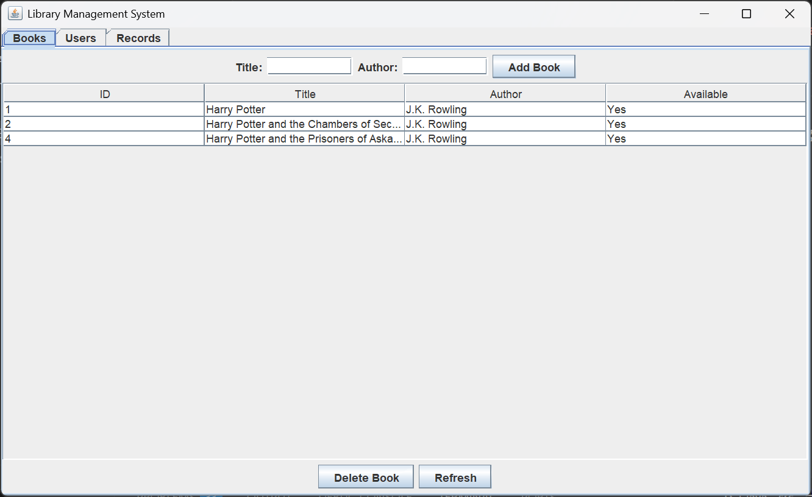
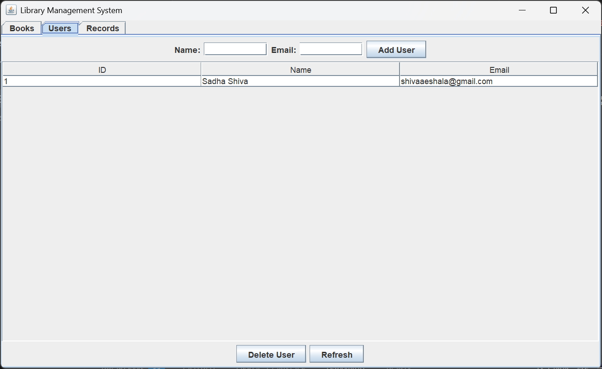
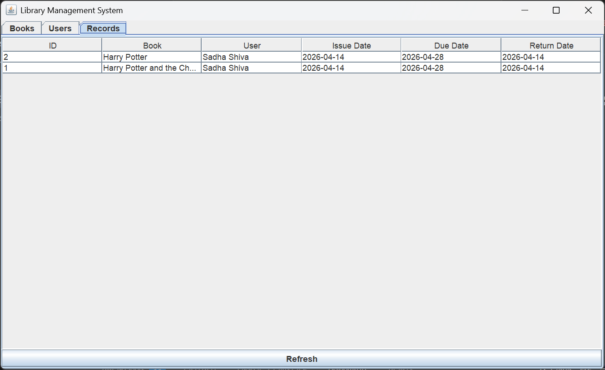

# Library Management System (Java + MySQL)

A desktop-based Library Management System built using Java Swing and MySQL to manage books, users, and transactions efficiently.

---

## 🚀 Features

* Add, delete, and view books
* User registration and management
* Issue and return books with due dates
* Fine calculation for late returns
* Track transactions with return dates
* Interactive GUI using Swing (JTable + Tabs)

---

## 🛠️ Tech Stack

* Java (Core + Swing)
* MySQL
* JDBC

---

## 📊 Screenshots

### 📚 Books Panel



### 👤 Users Panel



### 📄 Records Panel



---

## ⚙️ Setup Instructions

1. Install MySQL and create database using `schema.sql`
2. Add MySQL Connector/J (.jar) to project
3. Update DB credentials in `DBConnection.java`
4. Compile and run:

```
javac library/*.java
java -cp ".;mysql-connector-j-9.6.0.jar" library.Main
```
