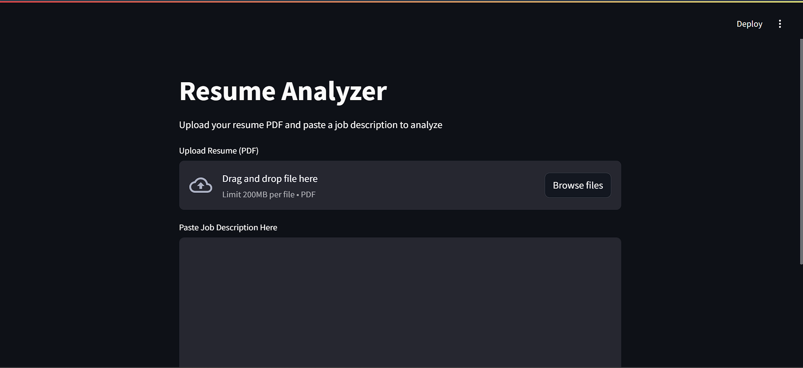
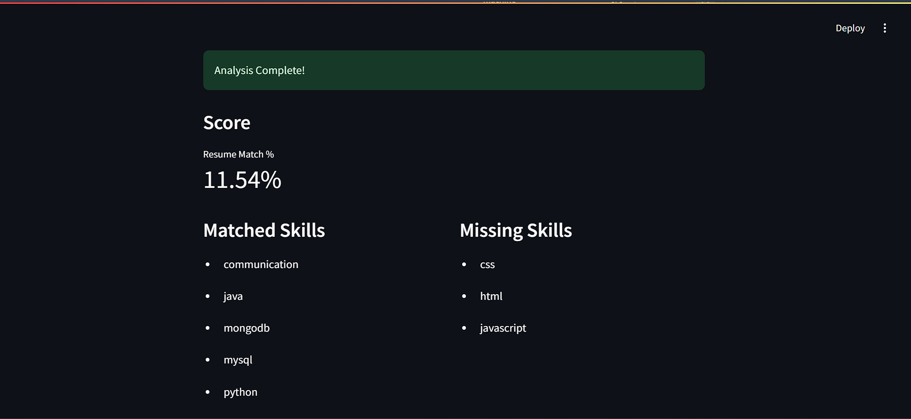

# Resume Analyzer and Job Matcher

An web application that analyzes resumes and matches them with job descriptions. It helps users improve their resumes by identifying missing skills, providing feedback, and suggesting improvements.

---

## 🚀 Features

* Extract skills using NLP (spaCy)
* Match score using TF-IDF + cosine similarity
* Identify matched skills
* Detect missing skills
* Section-wise feedback (Skills, Experience, Projects, etc.)
* Smart improvement suggestions

---

## 🛠️ Tech Stack

* Python
* Streamlit (UI)
* spaCy (NLP)
* Scikit-learn (TF-IDF, Cosine Similarity)
* pdfplumber (PDF text extraction)

---

## 📂 Project Structure

```
ai_resume_optimizer/
│
├── app.py
├── requirements.txt
├── README.md
├── screenshots/
│   ├── home.png
│   └── output.png
```

---

## ⚙️ Installation

### 1. Clone the repository

```bash
git clone https://github.com/shivaaeshala/Resume-Analyzer-Job-Matcher.git
cd Resume-Analyzer-Job-Matcher
```

### 2. Install dependencies

```bash
pip install -r requirements.txt
```

### 3. Download spaCy model

```bash
python -m spacy download en_core_web_sm
```

---

## ▶️ Run the Application

```bash
streamlit run app.py
```

Open in browser:

```
http://localhost:8501
```

---

## 📊 How It Works

1. Upload your resume (PDF)
2. Paste the job description
3. Click **Analyze Resume**
4. Get:

   * Match score
   * Matched skills
   * Missing skills
   * Section-wise feedback
   * Improvement suggestions

---

## 🧠 Core Logic

* **Skill Extraction:** Rule-based matching using predefined skill list
* **Similarity Score:** TF-IDF vectorization + cosine similarity
* **Feedback Engine:** Rule-based section detection
* **Suggestion Engine:** Context-aware recommendations

---

## 📸 Screenshots

### 🔹 Home Page



### 🔹 Analysis Output


